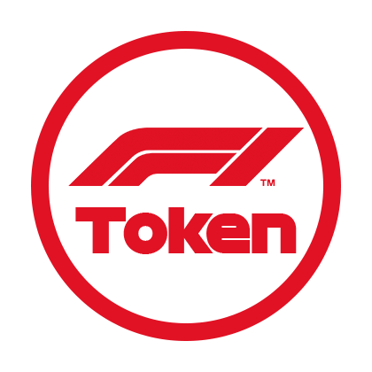
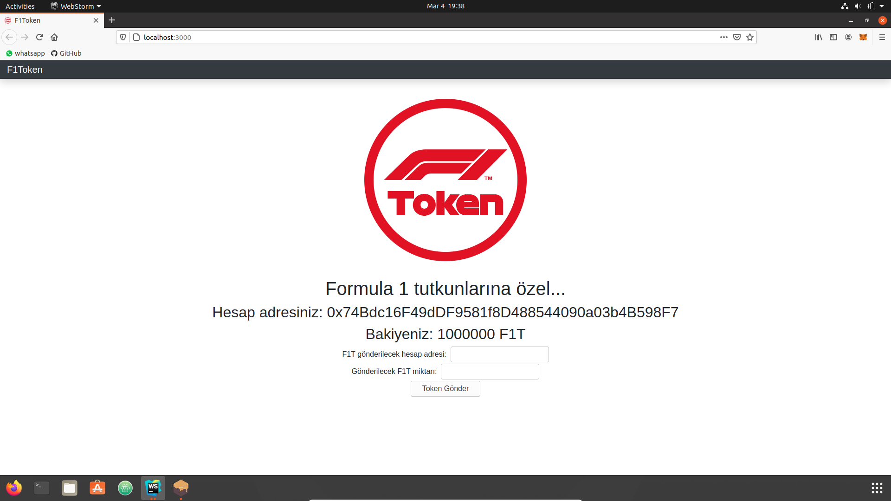
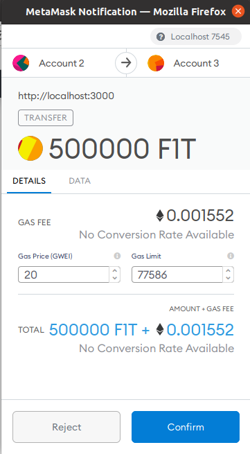
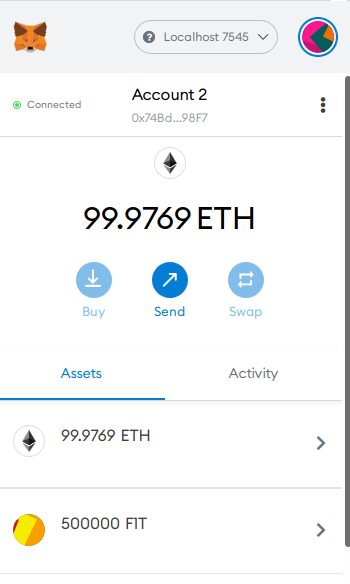
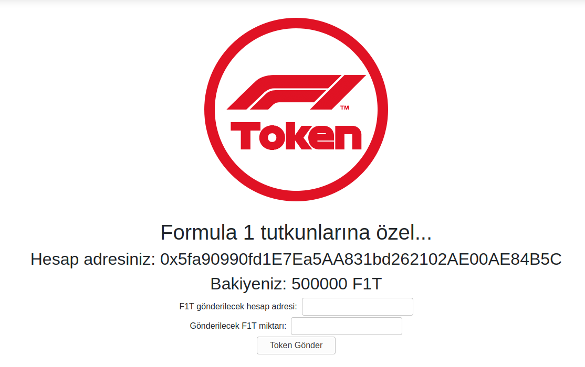

# F1Token 
<br><br>
F1Token, Formula 1 tutkunları için ERC-20 standartıyla oluşturulmuş bir tokendır. Yıl boyunca düzenlenen Formula 1 yarışlarındaki oluşacak sıralamaları doğru tahmin etme oranlarına göre bu 
# ERC-20 Tokenı nedir?
2014 yılında Vitalik Buterin tarafından kurulan ve merkeziyetsiz uygulamalar çıkarmak için bir açık kaynak platformu olan Ethereum üzerinde programlama yapabilmek için standartların belirlendiği teknik belgelere ERC (Ethereum Requests for Comments) denir. ERC, uygulamaların ve kontratların birbirleriyle daha kolay etkileşim kurmasını sağlar. <br><br>
Tokenların ERC-20 uyumlu olabilmesi için kontratın altı zorunlu fonksiyonu içermesi gerekir: totalSupply (toplam arz), balanceOf (bakiye), transfer (transfer), transferFrom (transferin kaynağı), approve (onay) ve allowance (kalan bakiye).

# Remix IDE kullanarak F1Tokenı oluşturma
Açık kaynaklı bir akıllı kontrat geliştirme ortamı olan Remix IDE üzerinde [contractımı](src/contracts) oluşturdum ve compile ettim. Deploy etme aşamasında "environment"ı Injected Web3 seçerek Metamask'i açtım ve Ropsten test ağına bağlandım. Metamask, ConsenSys tarafından oluşturulmuş kriptopara cüzdan eklentisidir.
<br><br>
Deploy işlemi kısa bir süre sonra tamamlandı ve [etherscan](https://ropsten.etherscan.io/address/0x9b9ad4f1820f8d025d354df9d6f3cdcf301cd3f8) üzerinden işlemi görüntüledim. Remix üzerinden name, symbol, totalSupply gibi fonksiyonların düzgün çalışıp çalışmadığını test etikten sonra [Melih Birim'in](https://ropsten.etherscan.io/address/0xe3a6450f513424115e9f8617fef433f0245b46b6#tokentxns) adresine 420,000 F1T gönderdim.
<br><br>
1,000,000 toplam arzı bulunan F1T'nin yüzde 42'si [Melih Birim'de](https://ropsten.etherscan.io/token/0x9b9ad4f1820f8d025d354df9d6f3cdcf301cd3f8#balances) bulunmaktadır.

# Yerel test ve arayüz
Yerel testler için ilk olarak React aracılığıyla basit bir proje oluşturdum. Tasarımsal eklemeler ve Web3 API kullanarak yaptığım altyapısal işlemler sonrasında Truffle Ganahce ile yerel bir Ethereum ağına sahip oldum. Aşağıdaki ilk iki komutu komut satırına yazdıktan sonra oluşturduğum contract yerel ağda çalışır duruma geldi. Son komut ile birlikte tarayıcı üzerinden arayüzüm açıldı ve Metamask'e yerel ağımdaki contract sahibinin adresi import ettim. Contract sahibi olması sebebiyle bu hesabın bakiyesi 1,000,000 F1T'tir.
```
truffle compile
truffle migrate

npm run start
```
Sonu "98F7" ile biten contract sahibi hesap:
<br><br>
<br><br>

Ağda bulunan ve sonu "4B5C" ile biten diğer bir hesaba 500,000 F1T gönderme işlemi (solda):
<br>
İşlem sonrası kalan bakiye (sağda):
<br>

 |  |
--- | --- |

Sonu "4B5C" ile biten ve token gönderilen hesabın bakiyesi:
<br><br>
<br><br>


